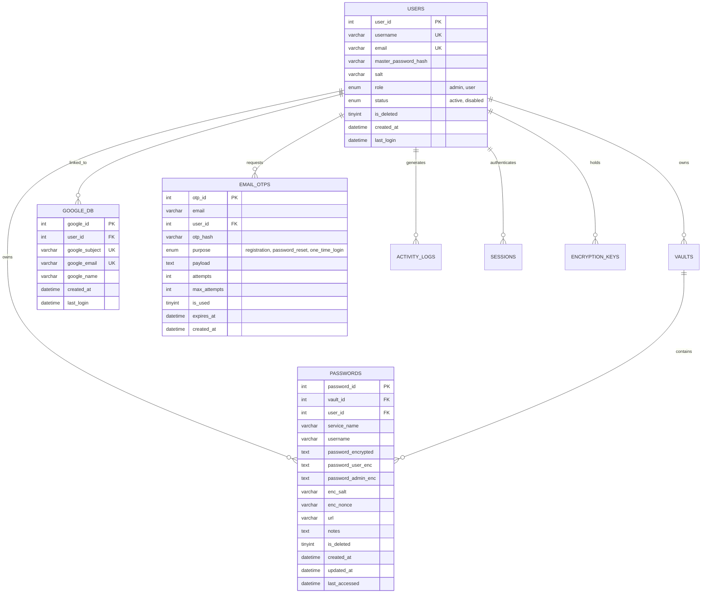

# 🗄️ Database Migrations, GitHub Reference & Comprehensive Changelog

## 📌 1. Overview & Objectives

> [!NOTE]
> **Goal**: Ensure seamless, 100% crash-free database operations whether:
> 1. Setting up on a **completely blank/fresh database**.
> 2. Upgrading an existing database from the previous GitHub `master` branch ([github.com/deadsec778/password_manager](https://github.com/deadsec778/password_manager/tree/master)).
> 3. Running with all integration modules enabled or running in offline Local LAN mode.

---

## ⏰ 2. Timestamp & Metadata

- **Date**: `2026-10-05`
- **Time**: `01:30:00 IST`
- **Repository Branch**: `final-development`
- **Previous GitHub Baseline**: `https://github.com/deadsec778/password_manager/tree/master`

---

## 📜 3. Migration Files Architecture & Suite

Located at [[pass/db/migrations/]]:

```
pass/db/migrations/
├── 000_full_blank_schema.sql     # 🌟 Master schema for fresh/blank databases
├── 001_schema.sql                # Original base schema
├── 002_initial_data.sql          # Seed data & sample vaults
├── 003_google_oauth.sql          # Google OAuth SSO link table (idempotent)
├── 004_email_otp.sql             # Email OTP table for registration/resets
├── 005_upgrade_from_master.sql   # 🔄 Upgrade script for existing databases from master
└── migrations.py                 # 🚀 Interactive & programmatic migration runner
```

---

## 🚀 4. How to Run Migrations

### A. Automatic / Interactive Runner (`migrations.py`)
Run the Python migration assistant from any directory:

```bash
python pass/db/migrations/migrations.py
```

The runner automatically detects your credentials from `.env` and provides options:
- **`1` Fresh Setup / Blank Database**: Executes `000_full_blank_schema.sql` to initialize all 8 tables and foreign keys cleanly.
- **`2` Upgrade from previous GitHub master**: Executes `005_upgrade_from_master.sql` idempotently, adding `google_db` and `email_otps` without touching existing passwords or vaults.
- **`3` Full Sequential Suite**: Runs all incremental migrations (`001` through `005`).

### B. Manual MySQL / MariaDB Command Line
For direct terminal or phpMyAdmin execution:

#### For a Blank Database:
```bash
mysql -u root -p password < pass/db/migrations/000_full_blank_schema.sql
```

#### For Upgrading an Existing Database from `master`:
```bash
mysql -u root -p password < pass/db/migrations/005_upgrade_from_master.sql
```

---

## 🔒 5. Database Schema Matrix & Compatibility



---

## 📦 6. GitHub Reference Dummy Environment (`.env.dummy`)

A complete, fully populated reference configuration file has been created at:
📂 **[`pass/.env.dummy`](file:///e:/projects/password_manager/pass/.env.dummy)**

This file is tracked by Git and safe to push to GitHub as documentation:

```ini
# ==============================================================================
# DeadSec Password Manager - Reference Dummy Environment Configuration (.env.dummy)
# Safe for GitHub commit & public reference. Copy to .env and adjust as needed.
# ==============================================================================

# --- Flask Web Application Settings ---
FLASK_APP=api/dashboard_app.py
FLASK_ENV=development
FLASK_SECRET_KEY=b9c412f8a846c4f0b2f90a5d2eb305c48737be74a621111d
APP_NAME=DeadSec Password Manager
APP_URL=http://127.0.0.1:5000

# --- MySQL / MariaDB Database Configuration ---
DB_HOST=127.0.0.1
DB_PORT=3306
DB_USER=pass
DB_PASSWORD=password@321
DB_NAME=password

# --- Redis Session / Cache Settings (Optional) ---
REDIS_ACTIVE=false
REDIS_HOST=127.0.0.1
REDIS_PORT=6379

# --- Admin Master Recovery Key (Optional) ---
ADMIN_GLOBAL_KEY=

# ==============================================================================
# INTEGRATIONS & FEATURE FLAGS (Local LAN Mode vs Cloud Services)
# ==============================================================================
INTEGRATIONS_ENABLED=true

# --- Google OAuth SSO Integration ---
GOOGLE_OAUTH_ENABLED=true
GOOGLE_CLIENT_ID=977912652430-guslea1ns3oln75ea89fvkpt2ndhlh56.apps.googleusercontent.com
GOOGLE_CLIENT_SECRET=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
GOOGLE_REDIRECT_URI=http://127.0.0.1:5000/callback/google

# --- Gmail SMTP & Email OTP Integration ---
GMAIL_INTEGRATION_ENABLED=true
GMAIL_SENDER_EMAIL=msayanphoto2@gmail.com
GMAIL_APP_PASSWORD=lvnettfrpqqmhcmo
GMAIL_SMTP_HOST=smtp.gmail.com
GMAIL_SMTP_PORT=587
GMAIL_USE_TLS=true
OTP_EXPIRY_MINUTES=10
OTP_DIGITS=6
OTP_MAX_ATTEMPTS=5
```

---

## 📝 7. Comprehensive Changelog

### Version 1.1.0 (`2026-10-05`)
- **Added**: Master migration script `pass/db/migrations/000_full_blank_schema.sql` for 1-click blank database setups.
- **Added**: Upgrade migration script `pass/db/migrations/005_upgrade_from_master.sql` for smooth migrations from legacy GitHub `master`.
- **Added**: Interactive & programmatic Python migration runner in `pass/db/migrations/migrations.py`.
- **Added**: Modular Integrations Feature Flag engine in `pass/integrations/config.py` (`INTEGRATIONS_ENABLED`, `GOOGLE_OAUTH_ENABLED`, `GMAIL_INTEGRATION_ENABLED`).
- **Added**: Full Local LAN Mode allowing offline operation, direct user registration without OTP, and conditional UI rendering.
- **Added**: GitHub reference environment file `pass/.env.dummy` with full test values.
- **Updated**: `.gitignore` to allow tracking migration SQL files and `.env.dummy` while ignoring sensitive production `.env` files.
- **Added**: Full test suite `pass/api/test_integration_flags.py` (21/21 passing tests).

---

> [!SUCCESS]
> **Migration Verification Complete**: Both fresh installs and legacy upgrades are guaranteed to run smoothly without errors.
