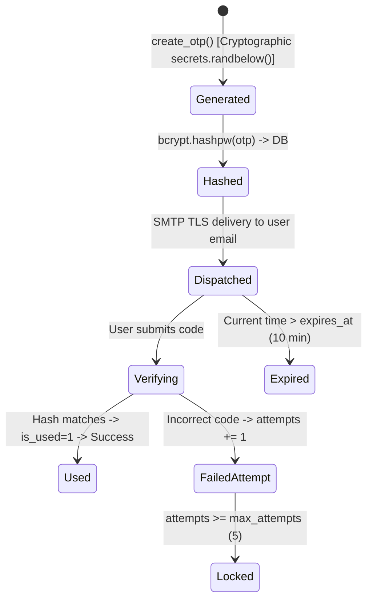

# 📬 Gmail SMTP & Cryptographic OTP Security Guide

> [!NOTE]
> Related Notes: [[Home]], [[Integrations-Module-Feature-Flags-and-Local-Mode]], [[Database-Migrations-and-GitHub-Reference-Changelog]], [[Local-LAN-Offline-Architecture]]

---

## 🎯 1. Overview & Setup

The Gmail SMTP integration handles:
1. **Account Registration Verification**: 6-digit OTP sent to new users before account creation.
2. **Password Resets & One-Time Login**: 6-digit OTP sent for password recovery.
3. **Security Alerts**: Instant notifications dispatched whenever account master passwords are changed.

### Required Environment Variables:
```ini
GMAIL_INTEGRATION_ENABLED=true
GMAIL_SENDER_EMAIL=your_email@gmail.com
GMAIL_APP_PASSWORD=your_16_character_app_password
GMAIL_SMTP_HOST=smtp.gmail.com
GMAIL_SMTP_PORT=587
GMAIL_USE_TLS=true
OTP_EXPIRY_MINUTES=10
OTP_DIGITS=6
OTP_MAX_ATTEMPTS=5
```

---

## 🔒 2. Cryptographic OTP Lifecycle & Security Model



### Security Defenses:
1. **No Plaintext OTP in Database**: The OTP code is hashed using `bcrypt` before storing in the database.
2. **Single-Use Enforced**: Marked with `is_used = 1` immediately upon successful verification.
3. **Brute-Force Lockout**: Max 5 attempts allowed per OTP token.
4. **Time-Limited Expiry**: Tokens expire in 10 minutes by default.
5. **TLS/SSL Resilience**: Automatically attempts TLS (Port 587) with SSL (Port 465) fallback.

---

## 🗄️ 3. Database Schema (`email_otps`)

```sql
CREATE TABLE IF NOT EXISTS `email_otps` (
  `otp_id` INT(11) NOT NULL AUTO_INCREMENT,
  `email` VARCHAR(150) NOT NULL,
  `user_id` INT(11) DEFAULT NULL,
  `otp_hash` VARCHAR(255) NOT NULL,
  `purpose` ENUM('registration', 'password_reset', 'one_time_login') NOT NULL,
  `payload` TEXT DEFAULT NULL,
  `attempts` INT(11) NOT NULL DEFAULT 0,
  `max_attempts` INT(11) NOT NULL DEFAULT 5,
  `is_used` TINYINT(1) NOT NULL DEFAULT 0,
  `expires_at` DATETIME NOT NULL,
  `created_at` DATETIME DEFAULT CURRENT_TIMESTAMP,
  PRIMARY KEY (`otp_id`),
  KEY `idx_email_purpose` (`email`, `purpose`),
  KEY `idx_expires` (`expires_at`),
  CONSTRAINT `fk_email_otps_user` FOREIGN KEY (`user_id`) REFERENCES `users` (`user_id`) ON DELETE CASCADE ON UPDATE CASCADE
) ENGINE=InnoDB DEFAULT CHARSET=utf8mb4 COLLATE=utf8mb4_unicode_ci;
```

---

## 🛡️ 4. Feature Flag & Local LAN Mode

When `GMAIL_INTEGRATION_ENABLED=false` or `INTEGRATIONS_ENABLED=false`:
- `send_email()` safely returns `(False, "Gmail integration is disabled in configuration.")` without opening sockets or hanging.
- Signup route bypasses email verification and creates local users directly.
- Forgot password route warns the user that email delivery is disabled in local mode.
