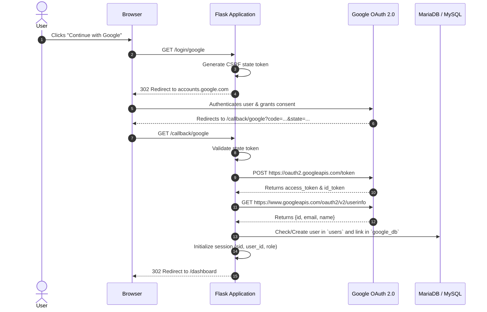

# 🔑 Google OAuth 2.0 Single Sign-On (SSO) Guide

> [!NOTE]
> Related Notes: [[Home]], [[Integrations-Module-Feature-Flags-and-Local-Mode]], [[Database-Migrations-and-GitHub-Reference-Changelog]]

---

## 🎯 1. Overview & Setup

The Google OAuth module allows users to authenticate seamlessly using their Google Account credentials.

### Required Environment Variables:
```ini
GOOGLE_OAUTH_ENABLED=true
GOOGLE_CLIENT_ID=your_client_id.apps.googleusercontent.com
GOOGLE_CLIENT_SECRET=your_client_secret
GOOGLE_REDIRECT_URI=http://127.0.0.1:5000/callback/google
```

---

## 🔄 2. OAuth 2.0 Authorization Flow



---

## 🔒 3. Database Schema (`google_db`)

```sql
CREATE TABLE IF NOT EXISTS `google_db` (
  `google_id` INT(11) NOT NULL AUTO_INCREMENT,
  `user_id` INT(11) NOT NULL,
  `google_subject` VARCHAR(255) NOT NULL,
  `google_email` VARCHAR(255) NOT NULL,
  `google_name` VARCHAR(255) DEFAULT NULL,
  `created_at` DATETIME DEFAULT CURRENT_TIMESTAMP,
  `last_login` DATETIME DEFAULT NULL,
  PRIMARY KEY (`google_id`),
  UNIQUE KEY `idx_google_subject` (`google_subject`),
  UNIQUE KEY `idx_google_email` (`google_email`),
  CONSTRAINT `fk_google_user` FOREIGN KEY (`user_id`) REFERENCES `users` (`user_id`) ON DELETE CASCADE ON UPDATE CASCADE
) ENGINE=InnoDB DEFAULT CHARSET=utf8mb4 COLLATE=utf8mb4_unicode_ci;
```

---

## 🛡️ 4. Feature Flag & Disabled State Behavior

When `GOOGLE_OAUTH_ENABLED=false` or `INTEGRATIONS_ENABLED=false`:
- The Google button is omitted from the login template.
- Direct GET requests to `/login/google` or `/callback/google` intercept the call, flash `"Google OAuth login is disabled in local mode."`, and redirect safely to `/`.
