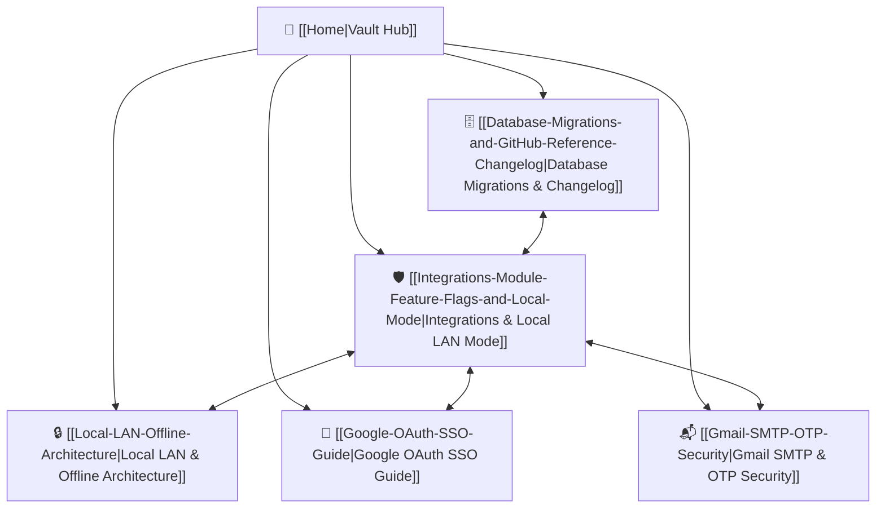

# 🏰 DeadSec Password Manager — Knowledge Base & Architecture Hub

Welcome to the **DeadSec Password Manager** Obsidian documentation vault. This vault contains complete technical architecture documentation, implementation decision records (ADRs), database schemas, security models, and step-by-step migration guides.

---

## 🗺️ Map of Content (MOC)



---

## 📚 Core Architecture Documents

### 1. 🛡️ [[Integrations-Module-Feature-Flags-and-Local-Mode]]
* **Scope**: Master feature flag system (`INTEGRATIONS_ENABLED`, `GOOGLE_OAUTH_ENABLED`, `GMAIL_INTEGRATION_ENABLED`), truth tables, dynamic module resolution, UI state management.
* **Key Topics**: How the application operates 100% offline vs hybrid cloud, fallback mechanisms, template conditionals.

### 2. 🗄️ [[Database-Migrations-and-GitHub-Reference-Changelog]]
* **Scope**: Complete schema definition for blank setups, migration scripts from legacy GitHub `master`, interactive Python migration assistant, and full Version `1.1.0` changelog.
* **Key Topics**: `000_full_blank_schema.sql`, `005_upgrade_from_master.sql`, MySQL/MariaDB collation compatibility, ER diagram.

### 3. 🔒 [[Local-LAN-Offline-Architecture]]
* **Scope**: Deep-dive on Zero-Cloud / Air-Gapped deployment patterns.
* **Key Topics**: Instant local user registration without email verification, administrative password resets, local vault encryption derived via PBKDF2/Fernet.

### 4. 🔑 [[Google-OAuth-SSO-Guide]]
* **Scope**: OAuth 2.0 flow, Google Cloud Console setup, user profile mapping, disabled-state URL guards.
* **Key Topics**: `google_db` schema, state verification, CSRF protection.

### 5. 📬 [[Gmail-SMTP-OTP-Security]]
* **Scope**: SMTP TLS/SSL transport, 6-digit cryptographic OTP tokens, bcrypt OTP hashing, brute-force throttling, and transaction lifecycles.
* **Key Topics**: `email_otps` table, rate limits, automatic expiration cleanup.

---

## ⚙️ Quick Reference Config Matrix

```ini
# --- Master Switch ---
INTEGRATIONS_ENABLED=true          # true = Cloud/Hybrid | false = 100% Local LAN

# --- Submodules ---
GOOGLE_OAUTH_ENABLED=true          # Google SSO login
GMAIL_INTEGRATION_ENABLED=true     # Email OTP & password resets

# --- Reference Files ---
# .env        -> Active local configuration (Git ignored)
# .env.dummy  -> Safe complete reference configuration (Tracked in Git)
# .env.example-> Minimal skeleton template (Tracked in Git)
```

---

> [!TIP]
> **Obsidian Graph View**: Press `Ctrl + G` (or `Cmd + G` on macOS) in Obsidian to visualize all interconnected architecture notes and relationships in the interactive graph!
