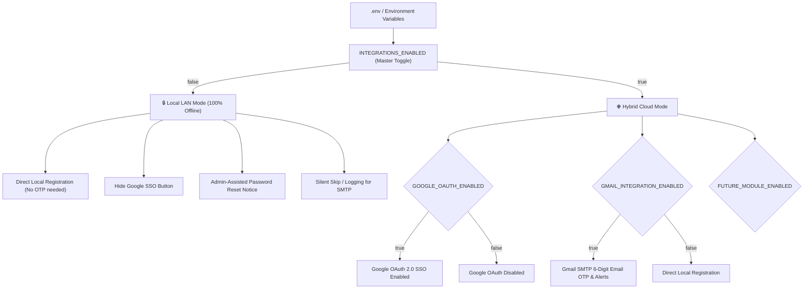

# 🛡️ Modular Integrations Feature Flags & Local LAN Mode

## 📌 1. Executive Summary & Why This Was Done

> [!NOTE]
> **Objective**: Decouple external cloud services (Google OAuth SSO, Gmail SMTP, Email OTP) from the core password manager so that the application can operate **100% locally and offline on private LAN networks**, while providing a future-proof modular toggle system in `.env`.

### Why this decision was made:
1. **Self-Hosted & Offline LAN Security**:
   - The primary ethos of this self-hosted password manager is data sovereignty and zero-knowledge privacy.
   - When deployed in isolated LAN environments, air-gapped homelabs, or internal private networks without internet access, attempting to connect to external endpoints (`smtp.gmail.com`, `accounts.google.com`) would cause timeouts, errors, or broken registration flows.
2. **Frictionless Local Testing & Development**:
   - Developers and homelab operators should not be forced to provide Google OAuth Client IDs or Gmail App Passwords just to spin up the service locally and test vaults/passwords.
3. **Future Module Extensibility**:
   - As new notification and auth channels are added (e.g., [[Discord Webhooks]], [[Telegram Bots]], [[LDAP / Active Directory]], [[S3 Automated Backups]]), each module can be independently toggled on or off without altering core business logic.

---

## ⏰ 2. When & Who

- **Date**: `2026-10-05`
- **Time**: `01:15:00 IST`
- **Initiator**: User (`deadsec778`)
- **Implementer**: Antigravity AI Pair Programmer
- **Codebase Scope**: `pass/.env`, `pass/.env.example`, `pass/integrations/`, `pass/api/dashboard_app.py`, `pass/api/templates/`

---

## 🏗️ 3. Architecture Overview & Decision Record



---

## ⚙️ 4. Environment Configuration Reference

The system introduces a hierarchical toggle system in `pass/.env` and `pass/.env.example`:

### Master Switch
```ini
# Master switch for all external third-party & cloud integrations.
# When set to 'false', the application runs in 100% offline / local LAN mode.
INTEGRATIONS_ENABLED=true
```

### Granular Module Switches
```ini
# --- Google OAuth SSO Integration ---
GOOGLE_OAUTH_ENABLED=true
GOOGLE_CLIENT_ID=your_client_id.apps.googleusercontent.com
GOOGLE_CLIENT_SECRET=your_client_secret
GOOGLE_REDIRECT_URI=http://127.0.0.1:5000/callback/google

# --- Gmail SMTP & Email OTP Integration ---
GMAIL_INTEGRATION_ENABLED=true
GMAIL_SENDER_EMAIL=your_email@gmail.com
GMAIL_APP_PASSWORD=your_16_character_app_password
GMAIL_SMTP_HOST=smtp.gmail.com
GMAIL_SMTP_PORT=587
GMAIL_USE_TLS=true
```

### Truth Table / Evaluation Hierarchy

| `INTEGRATIONS_ENABLED` | `GOOGLE_OAUTH_ENABLED` | `GMAIL_INTEGRATION_ENABLED` | Effective Google OAuth | Effective Gmail OTP | App Operation Mode |
| :---: | :---: | :---: | :---: | :---: | :---: |
| **`false`** | `true` | `true` | ❌ **Disabled** | ❌ **Disabled** | **Pure Local LAN Mode** |
| **`false`** | `false` | `false` | ❌ **Disabled** | ❌ **Disabled** | **Pure Local LAN Mode** |
| **`true`** | **`true`** | **`true`** | ✅ **Enabled** | ✅ **Enabled** | **Full Hybrid Mode** |
| **`true`** | ❌ `false` | ✅ `true` | ❌ **Disabled** | ✅ **Enabled** | **Email Only Mode** |
| **`true`** | ✅ `true` | ❌ `false` | ✅ **Enabled** | ❌ **Disabled** | **OAuth Only Mode** |

---

## 💻 5. Codebase Implementation Details

### A. Central Feature Flag Engine: `pass/integrations/config.py`
Located at [[pass/integrations/config.py]]:
- `is_integrations_master_enabled() -> bool`: Evaluates `INTEGRATIONS_ENABLED`.
- `is_google_oauth_enabled() -> bool`: Requires master switch + `GOOGLE_OAUTH_ENABLED`.
- `is_gmail_enabled() -> bool`: Requires master switch + `GMAIL_INTEGRATION_ENABLED`.
- `is_feature_enabled(feature_name: str, default: bool = True) -> bool`: Generic resolver for any current or future integration (e.g. `is_feature_enabled("discord")`).
- `get_integrations_status() -> dict`: Provides diagnostic status reporting for admin dashboards.

### B. Gmail Module Safeguards: `pass/integrations/gmail/`
- **`config.py`**: Added `is_gmail_enabled()`, `is_gmail_configured()`, and `is_gmail_active()`.
- **`email_service.py`**: `GmailSender.send_email()` checks `is_gmail_enabled()` before opening sockets or initializing TLS connections. If disabled, it returns `(False, "Gmail integration is disabled in configuration.")` without throwing exceptions or blocking the thread.

### C. Flask Backend Logic: `pass/api/dashboard_app.py`
1. **Global Context Processor**:
   ```python
   @app.context_processor
   def inject_integrations_context():
       return {
           "integrations_enabled": is_integrations_master_enabled(),
           "google_oauth_enabled": is_google_oauth_enabled(),
           "gmail_integration_enabled": is_gmail_enabled(),
           "integrations_status": get_integrations_status(),
       }
   ```
   Ensures every Jinja template automatically knows whether integrations are active.
2. **Signup Route (`/signup`)**:
   - If `is_gmail_enabled()` is **`True`**: Generates OTP, sends verification email, redirects to `/signup/verify`.
   - If `is_gmail_enabled()` is **`False`**: Calls `register_user(...)` directly, flashes `"Account created successfully (Local Mode)! You can now log in."`, and redirects to login.
3. **Forgot Password Routes (`/forgot-password`)**:
   - If disabled: Displays a clear notice to contact the local system administrator instead of attempting to send SMTP messages.
4. **Google OAuth Guard**:
   - `/login/google` and `/callback/google` check `is_google_oauth_enabled()`. If disabled, they flash `"Google OAuth login is disabled in local mode."` and redirect to login.

### D. User Interface Enhancements
- **`login.html`**: The "Continue with Google" button is conditionally wrapped inside ``.
- **`signup.html`**: Displays a subtle `<span class="badge">Local LAN Mode</span>` badge when running offline.
- **`forgot_password.html`**: Displays a helpful local mode banner explaining administrator credential recovery when email is disabled.

---

## 🔮 6. How to Add Future Integration Modules

To add a new integration module (e.g., `discord`, `telegram`, `ldap`, `s3_backup`):

1. **Add variables to `.env` and `.env.example`**:
   ```ini
   DISCORD_INTEGRATION_ENABLED=true
   DISCORD_WEBHOOK_URL=https://discord.com/api/webhooks/...
   ```
2. **Create integration folder**: `pass/integrations/discord/`
3. **Query status using the universal checker**:
   ```python
   from integrations import is_feature_enabled

   if is_feature_enabled("discord"):
       # send webhook alert
       ...
   ```

---

## 🧪 7. Automated Testing & Verification

A dedicated pytest suite was created in [[pass/api/test_integration_flags.py]]:
- `test_master_switch_disables_all_modules`: Verifies master switch completely disables all submodules.
- `test_granular_google_switch`: Tests isolated Google OAuth toggling.
- `test_granular_gmail_switch`: Tests isolated Gmail SMTP toggling.
- `test_future_module_extensibility`: Validates dynamic lookup for arbitrary future modules (`ldap`, `telegram`, `discord`).
- `test_email_sending_disabled_behavior`: Asserts SMTP skips network requests cleanly when disabled.
- `test_google_routes_guard_when_disabled`: Asserts 302 redirection for direct URL access when disabled.
- `test_login_page_google_button_hidden_when_disabled`: Verifies template rendering hides the OAuth button.
- `test_local_signup_creates_account_directly`: Verifies direct user creation without OTP in local mode.

**Test Results**:
```bash
pytest pass/
============================= 21 passed in 0.71s ==============================
```

---

> [!SUCCESS]
> **Complete & Verified**: The system now seamlessly switches between high-security Local LAN Mode and Cloud/Hybrid Mode via `.env` configuration.
