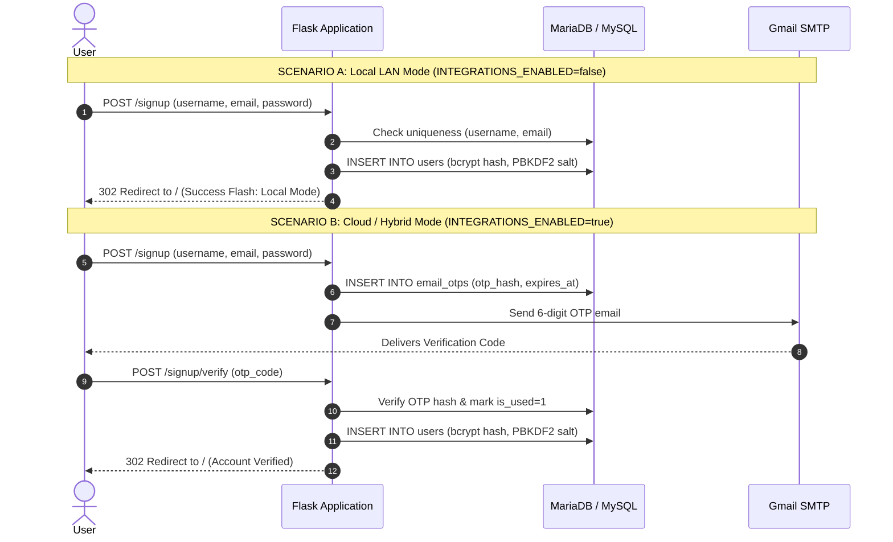

# 🔒 Zero-Cloud Local LAN & Offline Architecture

> [!NOTE]
> Related Notes: [[Home]], [[Integrations-Module-Feature-Flags-and-Local-Mode]], [[Database-Migrations-and-GitHub-Reference-Changelog]]

---

## 🎯 1. Design Principles for Local Mode

When `INTEGRATIONS_ENABLED=false` is configured in `.env`, the password manager guarantees:
1. **Zero Outbound Network Requests**: No sockets opened to Google OAuth, Google UserInfo API, or Gmail SMTP servers.
2. **Instant Local User Registration**: Eliminates the external email OTP dependency so administrators and users can sign up immediately on private LAN subnets.
3. **Graceful Degraded UI**: External sign-in buttons (Google SSO) and email recovery inputs automatically hide or display explanatory local badges.
4. **Local Security Preservation**: PBKDF2 (390,000 rounds) + Fernet encryption remain 100% per-user and zero-knowledge.

---

## 🔄 2. Local Mode vs Cloud Mode Workflows

---

## 🛡️ 3. Credential Recovery in Air-Gapped Environments

In cloud mode, forgotten passwords are recovered via one-time email OTP tokens. In local LAN mode:
- The `/forgot-password` endpoint displays an alert banner explaining that email delivery is disabled.
- Password resets are handled securely through administrative role permissions (`role = 'admin'`), where admins can reset or modify user accounts in the dashboard.

---

## 🧪 4. Verification

This architecture is validated by automated tests in `pass/api/test_integration_flags.py`:
- `test_local_signup_creates_account_directly`
- `test_google_routes_guard_when_disabled`
- `test_login_page_google_button_hidden_when_disabled`
